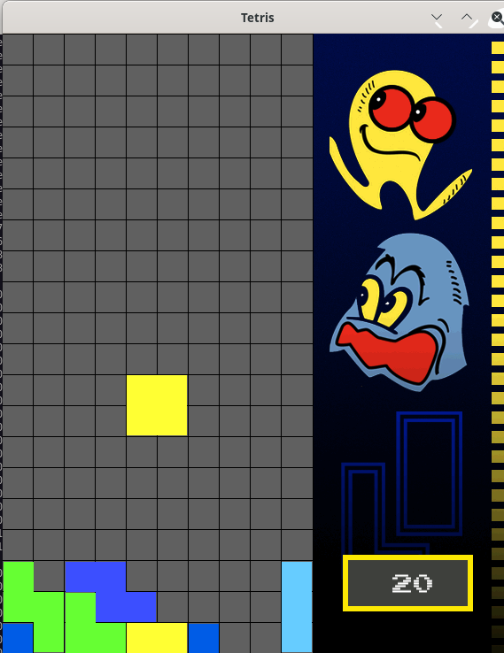
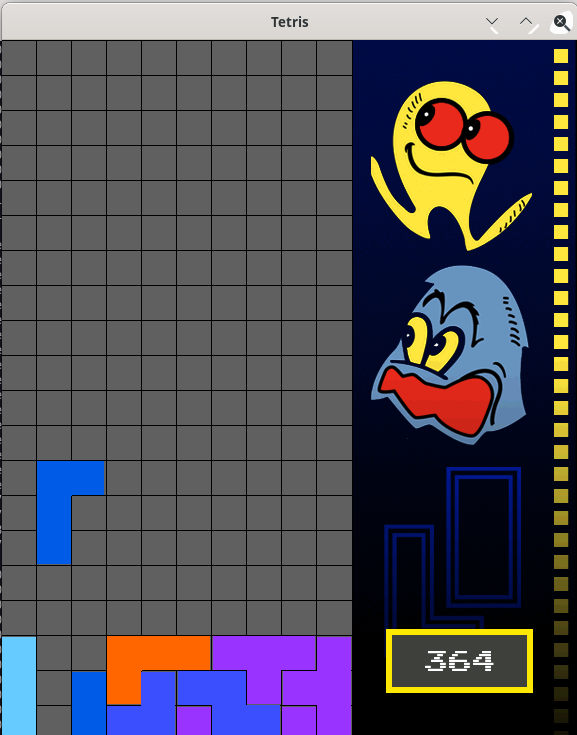

# Tetris using SFML
This is a basic Tetris implementation that I made during my journey of learning C++. 
This project makes use of the Simple and Fast Multimedia Library (SFML).
In order to compile, the following command can be executed:
`g++ *.cpp *.h -o Tetris  -lsfml-graphics -lsfml-window -lsfml-system`
A [Makefile](#Makefile) is also included for the connoiseurs.

### Look & feel

